# 💉 Dependency Injection (DI) Guide

**How Synapse uses DI for testable, maintainable services**

---

## 📋 Table of Contents

1. [What is DI and Why?](#what-is-di-and-why)
2. [The DI Container](#the-di-container)
3. [Registered Services](#registered-services)
4. [Using Services](#using-services)
5. [Creating New Services](#creating-new-services)
6. [Testing with DI](#testing-with-di)
7. [Common Patterns](#common-patterns)
8. [Troubleshooting](#troubleshooting)

---

## What is DI and Why?

### The Problem (Without DI)

```typescript
// ❌ BAD: Hard to test, tightly coupled
import prisma from '@/lib/prisma';
import { logger } from '@/lib/logger';

export class UserService {
  async getUser(id: string) {
    logger.log(`Getting user ${id}`); // Can't mock!
    return await prisma.user.findUnique({ where: { id } }); // Can't mock!
  }
}

// In tests: Can't mock prisma or logger! 😭
```

### The Solution (With DI)

```typescript
// ✅ GOOD: Easy to test, loosely coupled
export class UserService {
  constructor(
    private userRepo: UserRepository,  // Injected dependency
    private logger: ILogger            // Injected dependency
  ) {}

  async getUser(id: string) {
    this.logger.log(`Getting user ${id}`); // Can mock! ✅
    return await this.userRepo.findById(id); // Can mock! ✅
  }
}

// In tests: Easy to mock dependencies! 🎉
const mockRepo = { findById: jest.fn() };
const mockLogger = { log: jest.fn() };
const service = new UserService(mockRepo, mockLogger);
```

### Benefits

| Benefit | Description | Example |
|---------|-------------|---------|
| **Testability** | Mock dependencies easily | Test without real database |
| **Flexibility** | Swap implementations | Use different logger in production |
| **Clear Dependencies** | Explicit in constructor | Know what service needs at glance |
| **Singleton Management** | One instance per service | Efficient resource usage |
| **Configuration** | Runtime configuration | Load config from database |

---

## The DI Container

### Overview

Our DI container manages all services in a centralized way.

**Location:** `lib/di/container.ts`

**Key Features:**
- ✅ Supports both sync and async factories
- ✅ Singleton pattern (one instance per service)
- ✅ Lazy initialization (create only when needed)
- ✅ Cleanup support (destroy method for graceful shutdown)
- ✅ Runtime configuration via ConfigService

### Container API

```typescript
class DIContainer {
  // Register a service
  register<T>(
    key: string,              // Service identifier
    factory: () => T | Promise<T>,  // Factory function
    singleton: boolean = true // Cache instance?
  ): void

  // Resolve a service (async - preferred)
  async resolve<T>(key: string): Promise<T>

  // Resolve a service (sync - only for sync services)
  resolveSync<T>(key: string): T

  // Check if service is registered
  has(key: string): boolean

  // Clear singleton cache
  clearSingleton(key: string): void

  // Cleanup all services
  async destroy(): Promise<void>
}
```

---

## Registered Services

**All services are registered in:** `lib/di/providers.ts`

### Quick Reference

| Category | Services | Key |
|----------|----------|-----|
| **Infrastructure** | Logger | `logger` |
| | Redis | `redis` |
| | Cache | `cacheService` |
| | Config | `configService` |
| | Event Bus | `eventBus` |
| | Queue | `queueService` |
| | Push Notifications | `pushService` |
| **Repositories** | User Repository | `userRepository` |
| | Room Repository | `roomRepository` |
| | Message Repository | `messageRepository` |
| **Business Logic** | User Service | `userService` |
| | Room Service | `roomService` |
| | Message Service | `messageService` |
| | Message Notification | `messageNotificationService` |
| | Message Reaction | `messageReactionService` |
| | Message Read | `messageReadService` |
| | Admin Service | `adminService` |
| | Email Service | `emailService` |

### Service Dependency Graph

```mermaid
graph TD
    subgraph Core["Core Infrastructure"]
        Logger[Logger]
        Redis[Redis]
        Prisma[Prisma]
        Config[Config]
    end
    
    subgraph Support["Support Services"]
        Cache["CacheService<br/>(Redis + Logger)"]
        EventBus["EventBus<br/>(Redis + Logger)"]
        Queue["QueueService<br/>(Logger)"]
    end
    
    subgraph Repos["Repository Layer"]
        UserRepo["UserRepository<br/>(Prisma + Cache)"]
        RoomRepo["RoomRepository<br/>(Prisma + Cache)"]
        MessageRepo["MessageRepository<br/>(Prisma + Cache)"]
    end
    
    subgraph Services["Service Layer"]
        MsgService["MessageService<br/>• MessageRepository<br/>• RoomRepository<br/>• Logger<br/>• CacheService<br/>• MessageNotificationService<br/>• MessageReactionService<br/>• MessageReadService"]
        MsgNotifService["MessageNotificationService<br/>• RoomRepository<br/>• QueueService<br/>• Logger<br/>• PushService"]
    end
    
    Logger --> Cache
    Redis --> Cache
    Logger --> EventBus
    Redis --> EventBus
    Logger --> Queue
    
    Prisma --> UserRepo
    Cache --> UserRepo
    Prisma --> RoomRepo
    Cache --> RoomRepo
    Prisma --> MessageRepo
    Cache --> MessageRepo
    
    MessageRepo --> MsgService
    RoomRepo --> MsgService
    Logger --> MsgService
    Cache --> MsgService
    
    RoomRepo --> MsgNotifService
    Queue --> MsgNotifService
    Logger --> MsgNotifService
    
    style Core fill:#e1f5ff
    style Support fill:#fff4e1
    style Repos fill:#f0f4ff
    style Services fill:#e8f5e9
```



---

## Using Services

### In API Routes (Server Components)

**Pattern:** Always use `await getService<Type>('key')`

```typescript
// app/api/users/route.ts
import { getService } from '@/lib/di';
import type { UserService } from '@/lib/services/user.service';

export async function GET() {
  // ✅ Resolve service
  const userService = await getService<UserService>('userService');
  
  // Use service
  const users = await userService.getAllUsers();
  
  return NextResponse.json({ users });
}
```

### In Server Actions

```typescript
// app/actions/user-actions.ts
'use server';

import { getService } from '@/lib/di';
import type { UserService } from '@/lib/services/user.service';

export async function updateUserProfile(userId: string, data: UpdateUserDto) {
  const userService = await getService<UserService>('userService');
  return await userService.updateUser(userId, data);
}
```

### Multiple Services

```typescript
import { getService } from '@/lib/di';
import type { UserService } from '@/lib/services/user.service';
import type { RoomService } from '@/lib/services/room.service';
import type { ILogger } from '@/lib/logger/logger.interface';

export async function POST(req: NextRequest) {
  // Resolve multiple services
  const [userService, roomService, logger] = await Promise.all([
    getService<UserService>('userService'),
    getService<RoomService>('roomService'),
    getService<ILogger>('logger'),
  ]);

  // Use services
  const user = await userService.getUser(userId);
  const room = await roomService.getRoom(roomId);
  
  logger.log('Processing request', { userId, roomId });
  
  // ... business logic ...
}
```

---

## Creating New Services

### Step 1: Create the Service Class

**Location:** `lib/services/my-new.service.ts`

```typescript
// lib/services/notification.service.ts
import type { ILogger } from '@/lib/logger/logger.interface';
import type { UserRepository } from '@/lib/repositories/user.repository';
import type { QueueService } from '@/lib/queue/queue-service';

export class NotificationService {
  constructor(
    private userRepo: UserRepository,
    private queueService: QueueService,
    private logger: ILogger
  ) {}

  async sendNotification(userId: string, message: string): Promise<void> {
    // 1. Get user
    const user = await this.userRepo.findById(userId);
    if (!user) {
      this.logger.warn(`User not found: ${userId}`);
      return;
    }

    // 2. Queue notification
    await this.queueService.addPushNotification({
      userId,
      payload: {
        title: 'Notification',
        body: message,
      },
    });

    // 3. Log
    this.logger.log(`Notification sent to user ${userId}`);
  }
}
```

### Step 2: Register in DI Container

**Location:** `lib/di/providers.ts`

```typescript
// Add import
import { NotificationService } from '@/lib/services/notification.service';

// In setupDI() function, add registration:
export function setupDI(): void {
  // ... existing registrations ...

  // Register your new service
  container.register('notificationService', async () => {
    const userRepo = await container.resolve<UserRepository>('userRepository');
    const queueService = await container.resolve<QueueService>('queueService');
    const logger = await container.resolve<ILogger>('logger');
    
    return new NotificationService(userRepo, queueService, logger);
  }, true); // true = singleton
}
```

### Step 3: Use in API Routes

```typescript
// app/api/notifications/route.ts
import { getService } from '@/lib/di';
import type { NotificationService } from '@/lib/services/notification.service';

export async function POST(req: NextRequest) {
  const notificationService = await getService<NotificationService>('notificationService');
  
  const { userId, message } = await req.json();
  await notificationService.sendNotification(userId, message);
  
  return NextResponse.json({ success: true });
}
```

---

## Testing with DI

### Unit Testing Services

```typescript
// __tests__/services/notification.service.test.ts
import { NotificationService } from '@/lib/services/notification.service';

describe('NotificationService', () => {
  // Mock dependencies
  const mockUserRepo = {
    findById: jest.fn(),
  };

  const mockQueueService = {
    addPushNotification: jest.fn(),
  };

  const mockLogger = {
    log: jest.fn(),
    warn: jest.fn(),
  };

  let service: NotificationService;

  beforeEach(() => {
    // Create service with mocked dependencies
    service = new NotificationService(
      mockUserRepo as any,
      mockQueueService as any,
      mockLogger as any
    );

    // Reset mocks
    jest.clearAllMocks();
  });

  it('should send notification to existing user', async () => {
    // Arrange
    const userId = 'user_123';
    const message = 'Test notification';
    mockUserRepo.findById.mockResolvedValue({ id: userId, name: 'John' });

    // Act
    await service.sendNotification(userId, message);

    // Assert
    expect(mockUserRepo.findById).toHaveBeenCalledWith(userId);
    expect(mockQueueService.addPushNotification).toHaveBeenCalledWith({
      userId,
      payload: {
        title: 'Notification',
        body: message,
      },
    });
    expect(mockLogger.log).toHaveBeenCalled();
  });

  it('should handle non-existent user gracefully', async () => {
    // Arrange
    mockUserRepo.findById.mockResolvedValue(null);

    // Act
    await service.sendNotification('non_existent', 'Test');

    // Assert
    expect(mockQueueService.addPushNotification).not.toHaveBeenCalled();
    expect(mockLogger.warn).toHaveBeenCalledWith('User not found: non_existent');
  });
});
```

### Integration Testing with Test DI Container

```typescript
// __tests__/integration/api/users.test.ts
import { DIContainer } from '@/lib/di/container';
import { UserService } from '@/lib/services/user.service';

describe('User API Integration Tests', () => {
  let testContainer: DIContainer;

  beforeAll(() => {
    // Create test DI container
    testContainer = new DIContainer();

    // Register test implementations
    testContainer.register('logger', () => ({
      log: jest.fn(),
      error: jest.fn(),
    }), true);

    testContainer.register('userRepository', () => ({
      findAll: jest.fn().mockResolvedValue([
        { id: '1', name: 'User 1' },
        { id: '2', name: 'User 2' },
      ]),
    }), true);

    testContainer.register('userService', async () => {
      const userRepo = await testContainer.resolve('userRepository');
      const logger = await testContainer.resolve('logger');
      return new UserService(userRepo, logger);
    }, true);
  });

  afterAll(async () => {
    await testContainer.destroy();
  });

  it('should return all users', async () => {
    const userService = await testContainer.resolve<UserService>('userService');
    const users = await userService.getAllUsers();
    
    expect(users).toHaveLength(2);
    expect(users[0].name).toBe('User 1');
  });
});
```

---

## Common Patterns

### Pattern 1: Service Composition

**Use Case:** Service depends on other services

```typescript
export class MessageService {
  constructor(
    private messageRepo: MessageRepository,
    private roomRepo: RoomRepository,
    private logger: ILogger,
    private cacheService: CacheService,
    // Specialized services
    private notificationService: MessageNotificationService,
    private reactionService: MessageReactionService,
    private readService: MessageReadService
  ) {}

  async createMessage(data: CreateMessageDto): Promise<Message> {
    // Use composed services
    const message = await this.messageRepo.create(data);
    await this.notificationService.sendPushNotifications(
      data.roomId,
      data.userId,
      data.content,
      'text'
    );
    return message;
  }
}
```

**Registration:**
```typescript
// Register specialized services FIRST
container.register('messageNotificationService', async () => { ... });
container.register('messageReactionService', async () => { ... });
container.register('messageReadService', async () => { ... });

// Then register MessageService with all dependencies
container.register('messageService', async () => {
  const messageRepo = await container.resolve('messageRepository');
  const roomRepo = await container.resolve('roomRepository');
  const logger = await container.resolve('logger');
  const cacheService = await container.resolve('cacheService');
  const notificationService = await container.resolve('messageNotificationService');
  const reactionService = await container.resolve('messageReactionService');
  const readService = await container.resolve('messageReadService');
  
  return new MessageService(
    messageRepo,
    roomRepo,
    logger,
    cacheService,
    notificationService,
    reactionService,
    readService
  );
}, true);
```

---

### Pattern 2: Factory with Configuration

**Use Case:** Service needs runtime configuration

```typescript
export class EmailService {
  private transporter: any;

  constructor(
    private logger: ILogger,
    private config: EmailConfig
  ) {
    // Initialize with config
    this.transporter = nodemailer.createTransporter({
      host: config.smtpHost,
      port: config.smtpPort,
      auth: {
        user: config.smtpUser,
        pass: config.smtpPass,
      },
    });
  }
}
```

**Registration with ConfigService:**
```typescript
container.registerFactory(
  'emailService',
  async (config?: Record<string, unknown>) => {
    const logger = await container.resolve<ILogger>('logger');
    
    // Get email config from ConfigService or use defaults
    const emailConfig = config as EmailConfig || {
      smtpHost: process.env.SMTP_HOST!,
      smtpPort: parseInt(process.env.SMTP_PORT!),
      smtpUser: process.env.SMTP_USER!,
      smtpPass: process.env.SMTP_PASS!,
    };
    
    return new EmailService(logger, emailConfig);
  },
  'email.config' // ConfigService key
);
```

---

### Pattern 3: Lazy Loading (Server-Only Services)

**Use Case:** Prevent client bundling of server-only code

```typescript
// In lib/di/providers.ts
if (process.env.NEXT_RUNTIME === 'nodejs' || typeof window === 'undefined') {
  container.register('queueService', async () => {
    // Dynamic import to prevent client bundling
    const { QueueService } = await import('@/lib/queue/queue-service');
    const logger = await container.resolve<ILogger>('logger');
    return new QueueService(logger);
  }, true);
}
```

---

### Pattern 4: Cleanup on Shutdown

**Use Case:** Service holds resources that need cleanup

```typescript
export class QueueService {
  private queue: Queue;

  constructor(private logger: ILogger) {
    this.queue = new Queue('myQueue', { connection: redisConnection });
  }

  // Cleanup method - called by DI container on shutdown
  async destroy(): Promise<void> {
    this.logger.log('Closing queue connection...');
    await this.queue.close();
    this.logger.log('Queue connection closed');
  }
}
```

**Container automatically calls destroy():**
```typescript
// On application shutdown
await destroyDI(); // Calls destroy() on all services
```

---

## Troubleshooting

### Error: Service 'xyz' not found

**Cause:** Service not registered or typo in service key

**Solution:**
```typescript
// 1. Check if service is registered
container.has('myService'); // true or false

// 2. Check for typos
await getService<UserService>('userService'); // ✅ Correct
await getService<UserService>('UserService'); // ❌ Wrong (case-sensitive)

// 3. Check registration order in lib/di/providers.ts
```

---

### Error: Service factory returned a Promise. Use resolve() instead

**Cause:** Trying to use `resolveSync()` on an async service

**Solution:**
```typescript
// ❌ BAD: Using resolveSync on async service
const userService = container.resolveSync<UserService>('userService');

// ✅ GOOD: Use async resolve
const userService = await container.resolve<UserService>('userService');
```

---

### Error: Cannot resolve service in client component

**Cause:** DI container is server-only

**Solution:**
```typescript
// ❌ BAD: Trying to use DI in client component
'use client';
import { getService } from '@/lib/di'; // ❌ Server-only!

// ✅ GOOD: Use API routes or Server Actions
'use client';

export function MyComponent() {
  const { data } = useQuery(['users'], () =>
    fetch('/api/users').then(r => r.json())
  );
  
  // API route uses DI internally
}
```

---

### Circular Dependencies

**Cause:** Service A depends on Service B, and Service B depends on Service A

**Solution:** Use interface injection or refactor

```typescript
// ❌ BAD: Circular dependency
class ServiceA {
  constructor(private serviceB: ServiceB) {}
}

class ServiceB {
  constructor(private serviceA: ServiceA) {}
}

// ✅ GOOD: Extract shared logic to a third service
class SharedService {
  // Common logic
}

class ServiceA {
  constructor(private shared: SharedService) {}
}

class ServiceB {
  constructor(private shared: SharedService) {}
}
```

---

## Best Practices

### ✅ DO

1. **Always use DI for services**
   ```typescript
   const userService = await getService<UserService>('userService');
   ```

2. **Inject dependencies in constructor**
   ```typescript
   constructor(
     private userRepo: UserRepository,
     private logger: ILogger
   ) {}
   ```

3. **Use interfaces for flexibility**
   ```typescript
   constructor(private logger: ILogger) {} // ✅ Interface
   ```

4. **Register services as singletons**
   ```typescript
   container.register('myService', factory, true); // ✅ Singleton
   ```

5. **Handle errors gracefully**
   ```typescript
   try {
     const service = await getService('myService');
   } catch (error) {
     logger.error('Failed to resolve service', error);
   }
   ```

### ❌ DON'T

1. **Don't create services with `new` directly**
   ```typescript
   const service = new UserService(...); // ❌ Hard to test
   ```

2. **Don't use `any` type**
   ```typescript
   const service = await getService('userService'); // ❌ No type safety
   ```

3. **Don't access container directly in business logic**
   ```typescript
   class MyService {
     async doSomething() {
       const logger = await container.resolve('logger'); // ❌ Hidden dependency
     }
   }
   ```

4. **Don't resolve services in loops**
   ```typescript
   for (const item of items) {
     const service = await getService('myService'); // ❌ Inefficient
   }
   
   // ✅ Resolve once before loop
   const service = await getService('myService');
   for (const item of items) {
     await service.process(item);
   }
   ```

---

## Summary

**Key Takeaways:**

1. ✅ All services use DI - easier to test and maintain
2. ✅ 15+ services registered - check before creating new ones
3. ✅ Use `await getService<Type>('key')` in API routes
4. ✅ Inject dependencies in constructor for clarity
5. ✅ Services are singletons - one instance per app
6. ✅ Container handles cleanup automatically

**Next Steps:**

- Read [CODEBASE_GUIDE.md](./CODEBASE_GUIDE.md) for list of existing services
- Read [07-API-PATTERNS.md](./07-API-PATTERNS.md) for using services in API routes
- Practice: Try adding a simple service and using it in an API route!

---

**Need Help?** Check existing services in `lib/services/` for examples!

